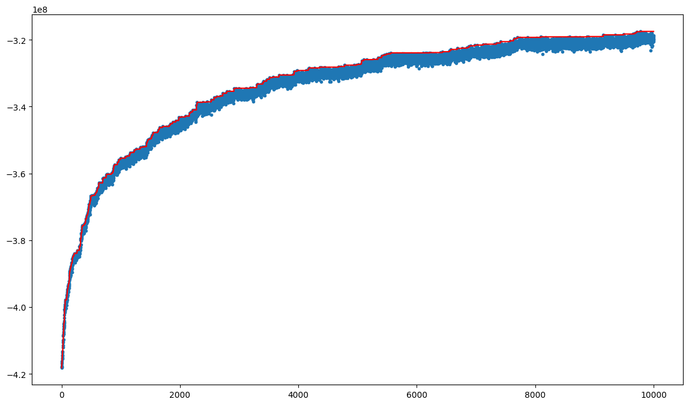
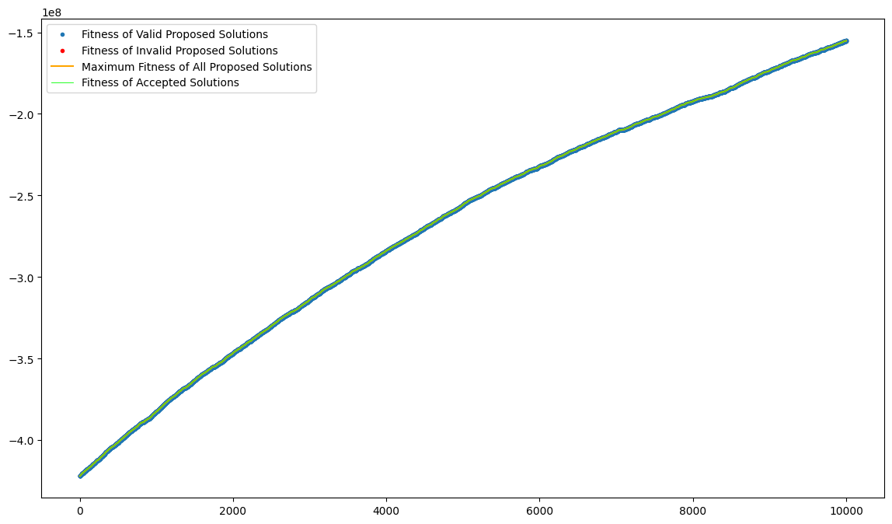
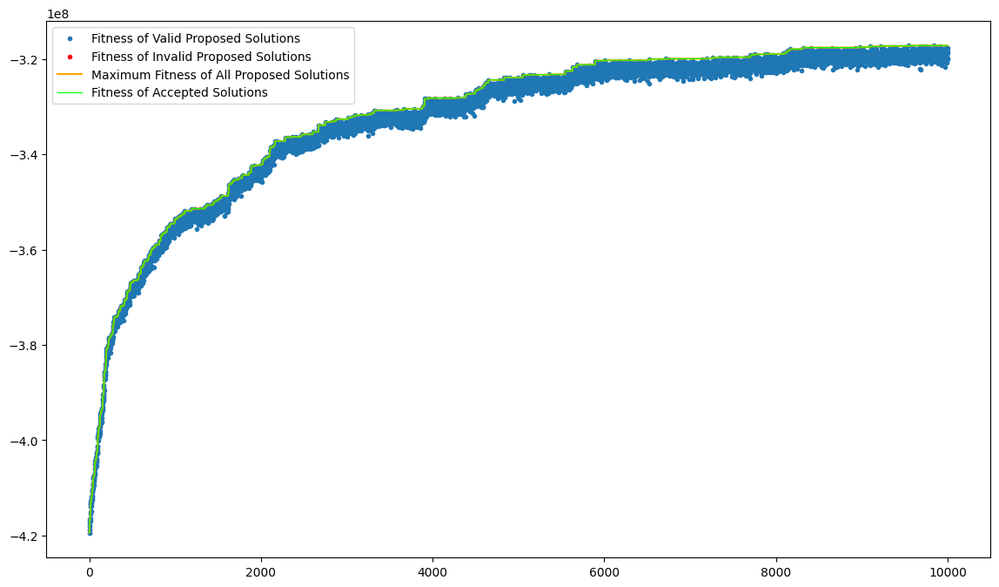

# CI2024_lab1
> *s314935 - Alessandro Di Matteo*

The purpose of this laboratory of Computational Intelligence was to provide a good algorithm to optimize the *Set Cover Problem* (see on [wikipedia](https://en.wikipedia.org/wiki/Set_cover_problem)).
In order to start from the same template, we were given:
- some generic problem dimensioning parameters, to be adjusted to test different problem sizes:
    ```python
    UNIVERSE_SIZE = 100_000
    NUM_SETS = 10_000
    DENSITY = 0.3
    ```
- a pseudocasual random number generator:
    ```python
    rng = np.random.Generator(np.random.PCG64([UNIVERSE_SIZE, NUM_SETS, int(10_000 * DENSITY)]))
    ```
- some predefined `SETS` and `COSTS` defining procedures:
    ```python
    # DON'T EDIT THESE LINES!
    SETS = np.random.random((NUM_SETS, UNIVERSE_SIZE)) < DENSITY
    for s in range(UNIVERSE_SIZE):
        if not np.any(SETS[:, s]):
            SETS[np.random.randint(NUM_SETS), s] = True
    COSTS = np.pow(SETS.sum(axis=1), 1.1)
    ```
Then, the other part was left to each student, even if some part was strongly infuenced by the advices presented in class.
In particular, i tried several alternatives of the algorithm (or three level of the algorithm) to find the best one, so before giving my considerations i provide a brief explaination.

> Note that for all the examples and values provided in this document, i refer to the model with parameters set as provided above.

## RHMC - *Random Mutation Hill Climber*
For the *RMHC*, i defined two basic tweaking function:
- `single_mutation_tweak` that only flips a single set (*take / not take*), providing the finest-grained tweaking function available for this kind of model.
- `multiple_mutation_tweak` that flips exactly `1%` (empirically tuned) of subsets in order to have a tweaking function more powerful that scale with the number of subsets.
After some tests, i decided that the multiple mutation tweak with `1%` flipping subsets was the most suited for this problem, and applying the RHMC algorithm i obtained this first solution
> For the given parameters, i started with a fitness equal to `-4.1822*10^8`, and in `10000` iterations i managed to increase the fitness up to `-3.1749*10^8`, considering fitness as the negative sum of all costs; i further provide a plot of the fitness:



## Simulated Annealing
Then, running the model with smaller universe size i noticed a fast convergence to a local maximum. For that reason, i introduced a temperature to provide an acceptation of worsening solution at high temperature; from empirical tests, i opted for choosing an **exponentially-decreasing temperature function**, multiplying the starting temperature (fine-tuned at each problem) at each step for a given constant called `alpha`.
The optimum value i found for `alpha` was `0.999`, as this value allowed to maintain high temperature a little bit longer in the initial phase.
> For the given parameters, i started with a fitness equal to `-4.2206*10^8`, and in `10000` iterations i managed to increase the fitness up to `-1.5508*10^8`, considering fitness as the negative sum of all costs; i further provide a plot of the fitness:

In this way i managed to linearize the trend of the fitness, that in *RHMC* was too much converging to a `log-like` shape.

## Iterated Local Search
The only problem is that as done before, the model was focused on **exploration** only in the initial of the algorithm and on **exploitation** in the last part of the algorithm.
This was great to add precision in finding the local maximum, but the risk was to get stuck in that local maximum if it was not the same of the global maximum.
For that reason, i introduced the possibility to have periodic restart of the algorithm, re-initializing the temperature at each restart of the algorithm but taking as starting solution the last solution of the former cycle.
This allows the system to restart from global maximum with a high temperature, allowing **exploration** startng from the local maximum of a known solution.
In the problem sized as said in the beginning, i found that the best value for the number of restarts was `2`, in order not to restart too early, following the increasing path when available.
> For the given parameters, i started with a fitness equal to `-4.1943*10^8`, and in `10000` iterations (split in `2` reps of `5000` iterations)  i managed to increase the fitness up to `-31721*10^8`, considering fitness as the negative sum of all costs; i further provide a plot of the fitness:


Notice that this time there was no improvement, instead the algorithm seems to behave worse than before: doing some attempts with different problem sizes, i figured out that this was probably caused by the fitness still not reaching the maximum in the restarting point. The algorithm proposed after this tried to solved this problem by exploiting a self-adapting tweaking function, hoping to accelerate the reach of local maximum before the restart.

## Self-Adapting Tweaking Function
As said above, i added the possibility of having a self-adaptation of the number of multiple mutation of the tweaking function, making it **larger when the fitness is increasing**, in order to speed-up the climb, and **smaller when stationary points are found**. In this way, i tried to avoid the model to reduce the impact of restarts on the reach of local maximum.
Thanks to empirical attempts, i decided to implement the **1 out of 5 rule**, with a linearly increasing portion of tweak, that was expressed in percent terms.

